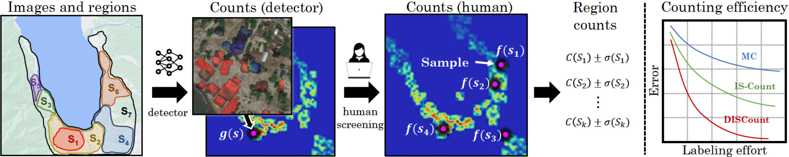

# DISCount 
### Counting in Large Image Collections with Detector-Based Importance Sampling

Python implementation of [DISCount: Counting in Large Image Collections with Detector-Based Importance Sampling](https://arxiv.org/abs/2306.03151). 
DISCount is lightweight and simple to use. The input to DISCount is a list with detector counts $g(s)$ per unit $s$. For instance a list $g(s)$ that contains the total number of damaged buildings (according to the detector) per tile $s$, or the total number of birds per day, etc. 



See below how DISCount works:

1. Run an off-the-shelf detector on all units $s$ (e.g., image tile from a large region) in the collection $S$ (e.g., a large satellite image of a region) to get detector counts $g(s)$.
2. **Initialize DISCount** using `estimator = kDISCount(g)`. This will compute the proposal distribution $q \propto g(s)$ to sample units from.
3. **Get samples** from $q$ using `samples = estimator.sample(n=10)`, where `samples` is a list of indices of sampled units (e.g., sampled tiles $s_i$ from the region $S$). 
4. **Human feedback:** In practice `samples` is used to retrieve the units to send to human annotators to screen (e.g., on a labeling UI), and get the verified or "true" count per sampled unit $f(s_i)$ (e.g., the "true" number of damaged buildings per image tile). 
5. Then, we **load the screened samples to the estimator** using `estimator.load(screened_samples)`. Now the estimator is ready to produce count estimates which will depend on the defined regions.
7. Finally, we can **produce the count estimate(s)** using `F_hat, CI = estimator.estimate(regions)`. `F_hat` are the count estimates $\hat{F}(S_i)$ for all subregions (`size(regions) == size(F_hat)`). `CI` returns the confidence intervals per count estimate.

See [demo](https://github.com/gperezs/DISCount/blob/main/demo.ipynb) for usage with different types of regions.

## Cite
If you find this code useful in your research, please consider citing:
```
@misc{perez2023discount,
      title={DISCount: Counting in Large Image Collections with Detector-Based Importance Sampling}, 
      author={Gustavo Perez and Subhransu Maji and Daniel Sheldon},
      year={2023},
      eprint={2306.03151},
      archivePrefix={arXiv},
      primaryClass={cs.CV}
}
```

## Acknowledgements
We thank Wenlong Zhao for the deployment of the roost detector, Maria Belotti, Yuting Deng, and our Colorado State University AeroEco Lab collaborators for providing the screened data of the Great Lakes radar stations, and Yunfei Luo for facilitating the building detections on the Palu Tsunami region. This work was supported by the National Science Foundation award #2017756.

